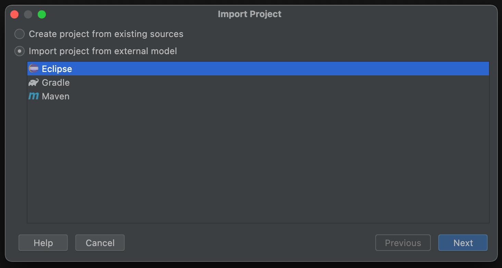
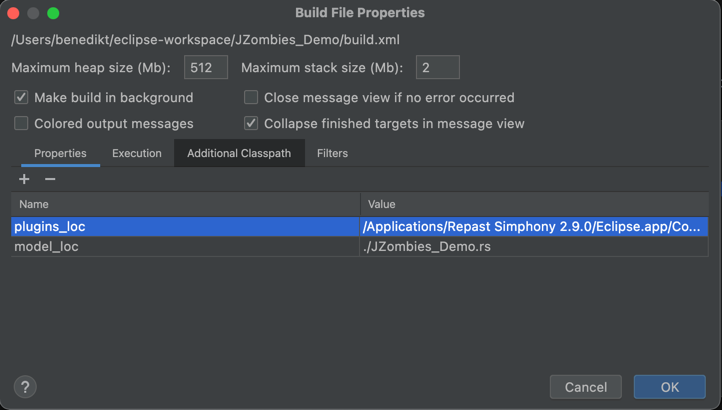
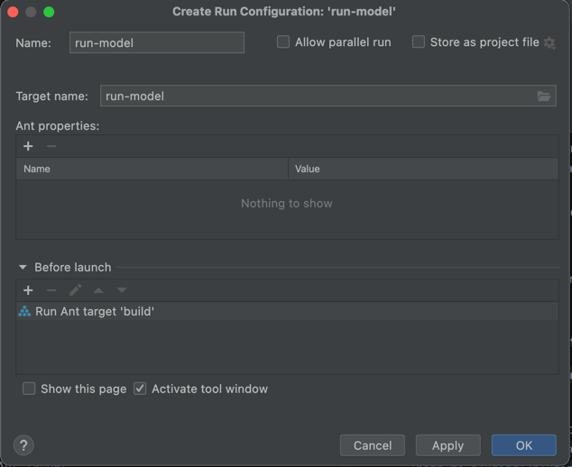
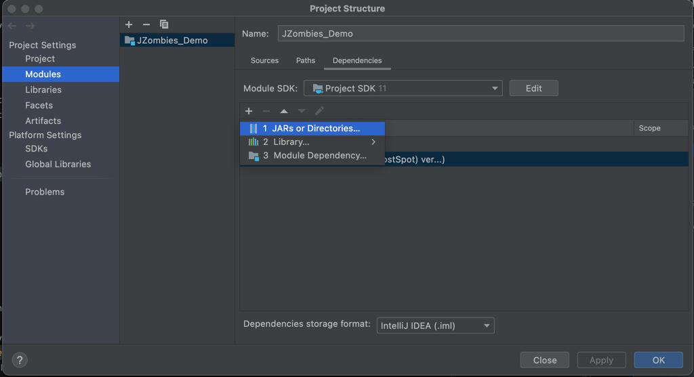
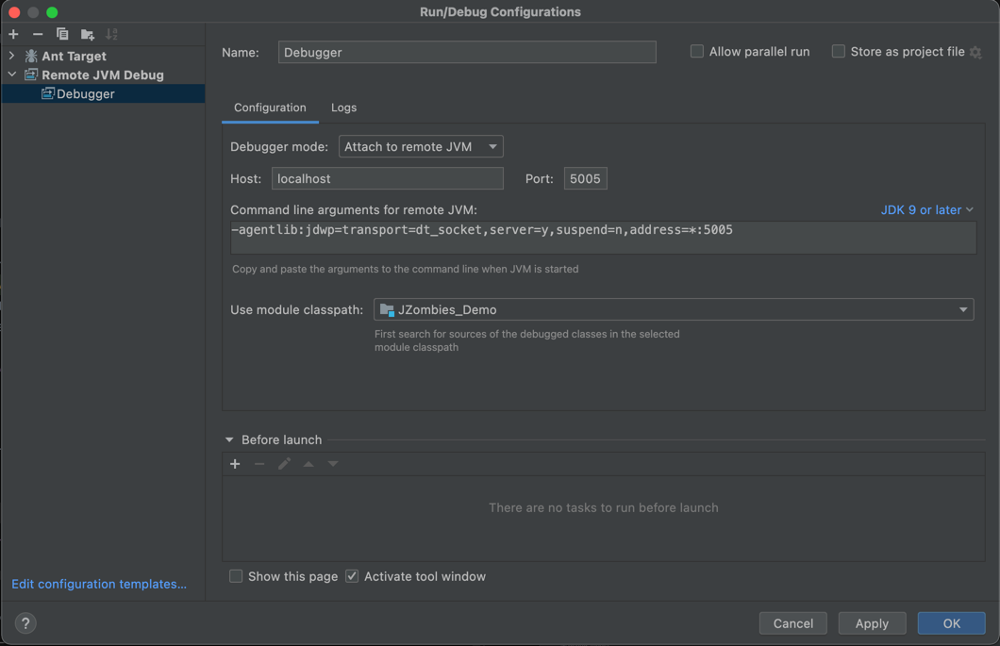

# Run Model (almost) w/o Eclipse

This project uses the Repast Simphony JZombies Model, taken from the [Repast Java Tutorials](https://repast.github.io/docs/RepastJavaGettingStarted.pdf) and shows how to use Repast Simphony (almost) without Eclipse.
This is especially useful, when the model is built in a `ci` pipeline or one wants to use another IDE, like Intellij IDEA.

## Requirements

Install [`adoptopenjdk11`](https://adoptium.net/?variant=openjdk11)

To run and build the model, Repast Simphony Runtime Libraries are needed. It is sufficient to just download (and unzip)
the [`plugins` folder](https://cloud.dfki.de/owncloud/index.php/s/xDgjP748jCcMcKG). Alternatively you can use your local
installation of Repast Simphony 2.9 .

- Note the path to the `plugins` folder. For Eclipse under macOS the path can look like  
  `/Applications/Repast Simphony 2.9.0/Eclipse.app/Contents/Eclipse/`
- The path has to be build with forward-slashes (`/`),  on Windows too

## Run from Command Line

- Install `ant`
- Set the `JAVA_HOME` environment variable to your `adoptopenjdk11` installation
- Clone the Repository

- In the project root run:
  ```shell
  ant build "-Dplugins_loc=[/absolute/path/to/plugins]"  "-Dmodel_loc=[relative/path/to/model.rs]"
  ant run-model "-Dplugins_loc=[/absolute/path/to/plugins]"  "-Dmodel_loc=[relative/path/to/model.rs]"
  ```
- Example:
  ```shell
  ant run-model "-Dplugins_loc=/Applications/Repast Simphony 2.9.0/Eclipse.app/Contents/Eclipse/" "-Dmodel_loc=./JZombies_Demo.rs"
  ```

### Available Targets
- Headless Batch Run as described in https://repast.github.io/docs/RepastBatchRunsGettingStarted.pdf
  ```shell
  ant run-batch "-Dplugins_loc=[/absolute/path/to/plugins]"  "-Dmodel_loc=[relative/path/to/model.rs]" "-Dargs=-hl -r -model_dir [/absolute/path/to/project/root] -b batch/batch_params.xml -o output -c batch_config.properties"
  ```
- Build the Model
  ```shell
  ant build "-Dplugins_loc=[/absolute/path/to/plugins]"  "-Dmodel_loc=[relative/path/to/model.rs]"
  ```
- Debug Model, opening Port 5005 for a Remote JVM Debugging Session
  ```shell
  ant debug-model "-Dplugins_loc=[/absolute/path/to/plugins]"  "-Dmodel_loc=[relative/path/to/model.rs]"
  ```
- Run the Batch-Runner GUI
  ```shell
  ant run-batch "-Dplugins_loc=[/absolute/path/to/plugins]"  "-Dmodel_loc=[relative/path/to/model.rs]"
  ```
- Run the Model GUI
  ```shell
  ant run-model "-Dplugins_loc=[/absolute/path/to/plugins]"  "-Dmodel_loc=[relative/path/to/model.rs]"
  ```

## Run the Repast Server as Docker Container
Reference to Repast Server: https://repast.github.io/docs/RepastNG/browser.html
```
docker-compose up -d --build
```

Go to `http://localhost:5000`

- To run a different Ant Target, like a headless batch run, change the executed `CMD` in the `docker-compose.yml`

## Build and Run in Intellij IDEA

- Clone the Repository
- Create new project from existing sources and choose import project from external model
  
- Select the `build.xml` file in the project root and set it as `Ant Build File` from the context menu
- Open the `Ant View` and edit the properties of the `build` Ant Target
- Add the `ECLIPSE_HOME` property with the path to the `plugins` folder as value
  
- 🔨 Build the Model by executing the `build` Ant Target
- 🚀 Run the Model by executing one of the `run-*` Ant Targets

### Create a Run Config (recommended)

Example for `run-model`:

- In the Context Menu of Ant Target select `Create Run Configuration`
- In the pop-up at `Before Launch` remove the default `Build` process and dd the `build` Ant Target
  

### Syntax Highlighting in Intellij

Under `File > Project Structure > Project Settings > Modules > SoSAD Draft > Dependencies`

- Add the `lib` folder in the project root
- Add the `repast.simphony.bin_and_src.jar` from the `plugins`
  folder: `[path_to_plugins]/plugins/repast.simphony.bin_and_src_2.9.0/repast.simphony.bin_and_src.jar`
  

### Add a Debugger 🐞

- Create a `Remote JVM Debug` run configuration (the default settings should be correct)
- Run the `debug-model` Ant Target
- Start the `Debugger`
  